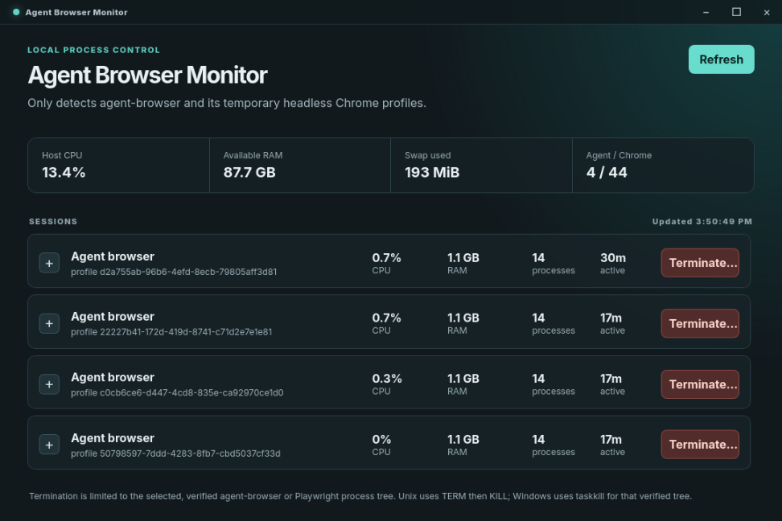

<p align="center">
  
</p>

<h1 align="center">Agent Browser Monitor</h1>

<p align="center">
  A fast, local desktop control panel for finding and ending leftover AI-agent and browser-automation sessions.
</p>

<p align="center">
  <a href="https://github.com/mrjw717/agent-browser-monitor/releases"></a>
  <a href="https://github.com/mrjw717/agent-browser-monitor/actions/workflows/release-rc.yml"></a>
  <a href="#platform-status"></a>
  <a href="#platform-status"></a>
</p>

<p align="center">
  <a href="#download">Download</a> · <a href="#what-it-does">What it does</a> · <a href="#platform-status">Platform status</a> · <a href="#build-from-source">Build from source</a>
</p>



## Take back the resources your agent left behind

An agent task can finish while its headless Chrome profile, Playwright runner, or preview-check browser keeps consuming CPU, memory, swap, and battery. Agent Browser Monitor gives you a deliberate, local view of those scoped processes—without listing or closing your everyday Chrome windows.

It is free, local-first, and does not require an account, API key, cloud service, or telemetry.

## Built for Vercel Agent Browser CLI

This companion app is built specifically to help clean up local sessions started by [**Agent Browser**](https://github.com/vercel-labs/agent-browser), Vercel Labs’ browser-automation CLI for AI agents. When an agent finishes testing a site, taking screenshots, or checking a preview, this monitor helps you see whether the local browser process tree actually exited.

Use the official [Vercel Agent Browser CLI repository](https://github.com/vercel-labs/agent-browser) to install and learn the automation tool. Use Agent Browser Monitor when you need a safe, visual way to inspect and end its leftover local browser sessions.

## What it does

- Finds scoped [`agent-browser`](https://github.com/vercel-labs/agent-browser), Playwright, and Vercel preview-check browser process trees.
- Shows process IDs, parent process, CPU, RAM, active time, and a redacted command summary.
- Lets you terminate only the selected, re-verified automation tree.
- Refreshes every three seconds, with no background service or browser extension.
- Keeps ordinary visible Chrome windows out of the list.

## Download

> **This project is in release-candidate stage.** Review the session details before using **Terminate**, especially when you intentionally have automation running.

1. Go to the [Releases page](https://github.com/mrjw717/agent-browser-monitor/releases).
2. Open the newest release marked **Pre-release**.
3. Download the file for your computer, then install it using the guide below.

| Your computer | Download from the release | Install |
| --- | --- | --- |
| Windows 10/11 | `.msi` recommended, or `-setup.exe` | Double-click the installer and follow the prompts. |
| macOS (Apple Silicon) | `.dmg` | Open it, then drag **Agent Browser Monitor** to **Applications**. |
| Ubuntu, Debian, Pop!_OS, Linux Mint | `.deb` | Double-click it, or run `sudo dpkg -i ./Agent.Browser.Monitor_*.deb`. |
| Other common Linux distributions | `.AppImage` | Run `chmod +x ./Agent.Browser.Monitor_*.AppImage`, then open it. |

After installation, launch **Agent Browser Monitor** from the Start menu, Applications folder, or desktop launcher. It works locally; an internet connection is not needed once it is installed.

## Platform status

| Platform | Installer | Runtime confidence | Notes |
| --- | --- | --- | --- |
| Linux | `.deb`, AppImage | **Tested on Linux** | Uses `/proc` for process discovery and supports live CPU/RAM/swap cards. |
| macOS (Apple Silicon) | `.dmg` | **Built in CI; not runtime-tested on a Mac yet** | Uses native `ps` discovery. Please report any issue you hit. |
| Windows 10/11 | `.msi`, setup `.exe` | **Built in CI; not runtime-tested on Windows yet** | Uses PowerShell/WMI discovery and `taskkill` for verified trees. |

The macOS and Windows installers are produced by successful native GitHub Actions builds, but the app has **not yet been manually tested on a physical macOS or Windows machine**. That distinction is intentional: package success is useful, but it is not a substitute for real-device testing.

## Safety by design

Before termination, the app re-checks that the selected process still matches its local automation markers. On Unix it sends `SIGTERM`, waits 700 ms, then sends `SIGKILL` only to processes that remain in that verified tree. On Windows it uses `taskkill` only for the verified tree.

It does not offer a “kill all Chrome” button. Ordinary Chrome windows are deliberately excluded.

## What it detects

- `agent-browser-linux-x64` and Chrome processes using `/tmp/agent-browser-chrome-*`;
- Playwright runners and browsers using Playwright temporary user-data directories;
- scoped Vercel preview-validation browser work.

Commands shown in the app are redacted for URLs and common token/key arguments.

## Build from source

Prerequisites: Node.js and the [Tauri v2 system dependencies](https://v2.tauri.app/start/prerequisites/).

```sh
git clone https://github.com/mrjw717/agent-browser-monitor.git
cd agent-browser-monitor
npm install
npm run tauri dev
```

To create local installer artifacts:

```sh
npm run tauri build
```

## Releasing a new RC

Pushing a tag such as `v0.1.0-rc.6` starts the release workflow. GitHub Actions builds the Linux, macOS, and Windows installers and publishes them to a prerelease. The workflow must be permitted to write releases.

## Contributing and support

Issues and small pull requests are welcome. If something is misidentified or a platform-specific installer does not work, please include your operating system version, the installer filename, and the non-sensitive error text or screenshot.
